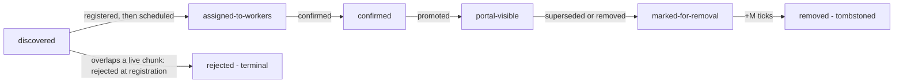

# MVCC storage protocol

Multi-version concurrency control for chunk assignments. It lets several versions of a chunk's
placement exist at once so the scheduler can replace, backfill, or reshuffle chunks without ever
serving a portal a stale route to a worker that no longer holds the data.

This doc is the protocol spine. The on-disk layout is in [mvcc-schema.md](mvcc-schema.md); the
placement algorithm that feeds it is in [capacity-aware-scheduling.md](capacity-aware-scheduling.md).

## Two assignments

The scheduler maintains two independent assignment streams:

- **Worker assignment** — what each worker must physically hold. A superset of every active
  portal assignment. Minted **once per scheduling cycle**.
- **Portal assignment** — a point-in-time view of the data lake that portals route by. Multiple
  portals may sit on different (recent) portal assignments and are expected to converge. Minted
  **once per visibility cycle**.

The two streams are non-1:1, so each has its **own monotonic id sequence**
(`sched_worker_assignments` / `sched_portal_assignments`). Ids are **never compared across
kinds** — ordering is used only within a kind (e.g. the confirmation watermark over worker ids),
and cross-kind links are always explicit foreign-key references (e.g. a drain anchored on the
portal assignment that dropped a pair). The schema does not *enforce* the no-cross-kind-compare
rule — both sequences are `BIGSERIAL` from 1, so the same numeric value can exist in both — but it
makes the distinction structural and visible: every referencing column targets exactly one of the
two id tables, so a mix-up is caught at code-review time, not by the engine.

## Invariants

1. **Single scheduler.** Only one scheduler instance may compute assignments at a time.
   Concurrent schedulers would corrupt the lifecycle state. Enforced by a Postgres advisory lock
   acquired at startup (see [mvcc-schema.md](mvcc-schema.md)).

2. **Two-phase publishing.** A chunk reaches portals only after workers confirm holding it, and a
   worker deletes data only after portals have stopped routing to it. This is the guarantee the
   whole protocol exists to provide.

3. **Promotion threshold.** A chunk is promoted to the portal assignment once its worker
   assignment is confirmed. "Confirmed" means an *X% quorum* of workers reported applying the
   assignment that includes the chunk; the remaining stragglers do not block promotion. The
   storage core promotes against a single confirmation **watermark** (the highest confirmed
   worker-assignment id); the X% quorum is computed by the caller and reported as that watermark.

4. **Removal safety window.** When a `(chunk, worker)` pair leaves the portal assignment, it must
   stay in the worker assignment for at least **M ticks** afterward, so a portal still routing to
   it on a stale snapshot keeps being served. The clock is anchored on **the moment the pair left
   the portal assignment** (i.e. when it was dropped from the confirmed routing portals read),
   never on the scheduling decision that re-routed it — a reshuffle scheduling a pair off a worker
   says nothing about whether a portal still routes there.

   One timing rule, two granularities, both anchored on the portal assignment that dropped the
   pair (the `created_at` of the referenced portal assignment; M is a logical tick count, not
   wall-clock):

   - **Whole-chunk removal** (backfill/compaction): the chunk is dropped (gate A) and all its
     pairs leave together. Anchored on `sched_chunk_metadata.dropped_at_portal_assignment_id`.
   - **Single-pair removal** (reshuffle): one pair leaves the confirmed routing (gate B) while
     the chunk stays visible. Anchored on `sched_stale_mappings.dropped_at_portal_assignment_id`.

5. **A correction's drop and promote are one atomic swap.** When a correction replaces a chunk,
   the portal assignment must never contain both the original and the replacement at once. The
   replacement is held out of the portal until it confirms, then the same visibility-cycle
   transaction drops the original and promotes the replacement — portals never see an overlap.
   Workers may temporarily hold both during the transition; that overlap in the *worker*
   assignment is expected.

   The schema enforces that a correction is non-self (`CHECK old_chunk_pk <> new_chunk_pk`) and
   same-dataset (the `chunk_corrections_same_dataset` trigger). It does not check same block range at
   the SQL layer; instead `register_correction` rejects a range-changing replacement
   (`CorrectionRejected`) before inserting it, so the 1-to-1 same-range swap is a checked invariant at
   registration, not just caller discipline (see [nonoverlap-promotion-gate.md](nonoverlap-promotion-gate.md)).

## The two-gate model

For any chunk at any moment the protocol answers two **independent** questions:

**(A) Should this chunk be visible to portals at all?** A chunk-level decision. A chunk becomes
visible the first time a visibility cycle promotes it (sets `applied_at_portal_assignment_id`)
and stays visible until it is dropped (`dropped_at_portal_assignment_id`). Promotion is gated on
the chunk's worker assignment being confirmed (Invariant 3).

**(B) For a visible chunk, which workers should portals route to?** A per-`(chunk, worker)`
decision. Portals route only to the workers chosen by the **highest confirmed worker
assignment**. Later scheduling cycles may have computed newer routing, but that becomes visible
only once the corresponding worker assignment is confirmed.

The gates are independent: a visible chunk can have its routing "frozen" at an older worker
assignment while a newer re-route is still unconfirmed; conversely the latest scheduling decision
can move routing forward without affecting visibility — promoted chunks stay promoted.

Implementations therefore keep **two** chunk→workers mappings: the *latest scheduled* routing
(`sched_ideal_chunk_workers`, what workers download from) and the *confirmed* routing
(`sched_confirmed_chunk_workers`, what portals route by). Neither can be derived from the other.

## Chunk lifecycle

Each state maps to a column on `sched_chunk_metadata`: `applied_at_worker_assignment_id`
(assigned) → confirmation watermark (confirmed) → `applied_at_portal_assignment_id` (visible) →
`marked_for_removal` (retiring) → `dropped_at_portal_assignment_id` then, M ticks later,
`dropped_from_worker_assignment_at` (removed — the row is retained as a **tombstone**, not deleted). The `rejected` flag is the terminal off-ramp: a chunk
refused at registration for overlapping a live chunk in its dataset gets a row with `rejected = TRUE`
and never enters the chain — never scheduled, never reconsidered (see
[nonoverlap-promotion-gate.md](nonoverlap-promotion-gate.md)).

## Flows

### Adding a new chunk

1. Chunk discovered and inserted.
2. Registration admits it with a default `sched_chunk_metadata` row — unless it overlaps a live
   chunk in its dataset, in which case it gets a terminal `rejected = TRUE` row and stops here.
3. Scheduling cycle includes it in the worker assignment; workers download it.
4. Workers confirm (Invariant 3).
5. Visibility cycle promotes it to the portal assignment; portals start routing to it.

### Chunk migration (worker A → worker B)

1. Add the chunk to B in the **worker assignment**.
2. B downloads and confirms.
3. In one portal update: add chunk→B and remove chunk→A from the **portal assignment**.
4. Wait M ticks (Invariant 4).
5. Remove the chunk from A in the **worker assignment**; A deletes it.

This is the per-pair (gate B) path; the bookkeeping behind steps 3–5 is the
[deferred removal](#deferred-removal-stale-mappings) sub-protocol.

### Replication factor decrease (R=3 → R=2)

1. The portal assignment is recomputed at R=2; portals see fewer mappings.
2. Workers keep serving at R=3 through the M-tick window (Invariant 4).
3. After M ticks the worker assignment is recomputed at R=2; workers drop the excess replicas.

### Replication factor increase (R=2 → R=3)

1. New replicas are added to the worker assignment immediately; workers download them.
2. Workers confirm (Invariant 3).
3. New replicas appear in the portal assignment; portals start routing to them.

### Adding chunks that force a replication decrease

Ingestion is staged automatically — no explicit reservation. Pending chunks (registered but not
yet placed) are counted in the scheduling input, so their size pulls the derived replication
factor down, which makes existing chunks shed copies; those copies drain over M ticks and free
the room the new chunks need. New chunks are admitted only into genuinely free capacity (per
worker, `capacity − what it currently holds, including draining copies`), so whatever doesn't fit
stays pending for a later cycle.

*Example* — 100 chunks at R=3, 10 new chunks; all 110 only fit at R=2:
- **Cycle 1:** the 10 pending chunks pull the whole set to R=2. Existing chunks shed their 3rd
  copy (begins draining). Disk is still nearly full, so only a little of the new data fits; the
  rest stays pending.
- **Cycle 2 (after M ticks):** shed copies have drained; the remaining new chunks land, still at
  R=2.

If the full set cannot fit even at `min_replication`, no new chunks are admitted and the
scheduler signals backpressure (add capacity) rather than dropping below the floor. The placement
mechanics are in [capacity-aware-scheduling.md](capacity-aware-scheduling.md).

---

## Corrections

A correction records *what replaces a chunk*. The `marked_for_removal` mark alone can remove a
chunk but cannot express a replacement; corrections let the scheduler promote the replacement and
drop the original atomically (Invariant 5).

### Scope (and what is out of scope)

A correction is exactly **one old chunk replaced by one new chunk covering the same block
range**. That is the whole model. Out of scope:

- **N-to-M, N-to-1, 1-to-N swaps** (re-partitioning a block range). These must be applied as one
  atomic unit to preserve Invariant 5; expressed as independent 1-to-1 rows they would fire
  piecewise and leave gaps or overlaps. Supporting them needs a batch/swap-set abstraction this
  model does not have. Keeping corrections strictly 1-to-1 is also what guarantees forward
  progress: each correction frees its old chunk independently once its single replacement
  confirms, so there is no all-or-nothing set to stall.
- **Additive backfill** (filling a gap with no prior chunk). No old chunk to supersede, so no
  correction — the new chunk uses the standard addition flow.

### Pending vs completed

A correction is **pending** while `applied_at_portal_assignment_id IS NULL` and **completed**
once the visibility cycle stamps that column. Completed rows are **retained as an audit trail**,
never deleted, so the old→new lineage outlives the swap. Every readiness/promotion predicate
treats "pending" as `applied_at_portal_assignment_id IS NULL`, so completed rows are inert.

### Registration

Corrections are registered out of band by the **backfill/ingestion process**, not by the
scheduler's cycles. That process submits the replacement chunk together with the old chunk it
supersedes; the replacement (in the old chunk's dataset) and the `chunk_corrections` record are
committed **atomically**.

The atomic commit is what makes this safe: a chunk becomes promotable the moment it exists, so
were the correction record a separate write, a crash between them would strand the replacement as
an ordinary additive chunk — its intent lost, both chunks surfacing in the portal (violating
Invariant 5).

Registration is rejected if the old chunk is unknown, if it already has a correction (one
replacement per chunk, including a completed audit row), if it is already being removed, or if
the replacement already exists in the dataset (see `CorrectionRejected` for the exact precedence).

To redirect a correction (A→B was wrong), register B→C: A→B fires first, then B→C. Corrections are
ordered only by their structural dependencies — a correction is not a promotion candidate while its
old chunk is still the `new_chunk_pk` of a pending correction (an earlier chain link has yet to
produce it). A chain (B→C after A→B) resolves naturally — B appears briefly as an intermediate
state, which is intentional. Independent corrections in the same dataset carry no such link and may
fire in the same cycle.

Cross-correction **cycles cannot occur**. `register_correction` always creates the replacement as
a brand-new chunk — it never designates an existing chunk as the new side. Closing a cycle would
require some correction to point its new side at a chunk that already exists (e.g. B→A while A→B
is pending, where A is already present). That is structurally impossible: the new side is freshly
minted and coincides with nothing else in the system. The correction graph is always a forest of
forward chains, never a cycle.

### Promotion readiness

A correction is ready when:
1. `new_chunk_pk` is confirmed (`applied_at_worker_assignment_id <=` the confirmation watermark), and
2. no pending correction has `new_chunk_pk = this.old_chunk_pk` — this chunk is not still being
   produced by an unapplied earlier chain link.

### Visibility-cycle ordering

Portal promotion of a replacement is **exclusively** owned by the correction machinery: the
normal promote-eligible pass (step 2 below) must skip any chunk that is the `new_chunk_pk` of a
pending correction, and any chunk with `marked_for_removal` set. The visibility cycle runs these
steps in **one transaction**:

1. **Apply ready corrections** (before the standard promote/drop pass). Resolve the ready set with
   an order-independent fixpoint, **re-evaluating readiness as each applies** so a chain (A→B→C)
   collapses in one cycle. For each: set `marked_for_removal` on `old_chunk_pk`, then mark the
   correction completed by stamping its `applied_at_portal_assignment_id`. The row is retained.
2. **Promote eligible chunks** — skipping pending `new_chunk_pk` values and `marked_for_removal`
   chunks. Replacements whose correction just completed in step 1 are no longer pending and are
   promoted here.
3. **Drop marked chunks** — picks up the `marked_for_removal` stamps from step 1 and drops the
   old chunks.

Because the three steps share one transaction, the portal jumps straight from the old chunk to
the new one and never observes both (Invariant 5).

The `marked_for_removal` skip in step 2 matters when a chain collapses in one cycle: with A→B and
B→C both firing in step 1, B is both A→B's (now-removed) target and B→C's old chunk, so B ends
step 1 marked for removal. The skip prevents B from being promoted and dropped in the same
transaction ("born dropped"). It is a consistency cleanup, not a visible flicker — within the
transaction B is never shown.

### Unified removal

`marked_for_removal` is the single mechanism that removes a chunk from the portal, whether
removed outright or replaced. The `chunk_corrections` table drives *when* the mark is set; the
actual drop always goes through the drop-marked step. A chunk must not carry both `marked_for_removal`
and a **pending** correction — mutually exclusive. They do coexist once **completed**: step 1 sets
the mark and stamps the correction together, after which the old chunk carries both the removal
mark and its retained audit row. Expected.

---

## Deferred removal (stale mappings)

### Problem

The two-phase mechanism protects chunk-level events (additions, backfills, replication changes).
It does **not** by itself protect `(chunk, worker)` mapping changes caused by **reshuffling**.
When the worker set changes (join, leave, PeerId rotation, version upgrade) the algorithm
recomputes placement and some chunks move. The losing worker sees the new assignment, doesn't
find the chunk, and deletes it — breaking any portal still routing there on a stale snapshot.

This is the same class of problem Invariant 4 solves for whole-chunk removal, applied to the
per-pair (gate B) case.

### Design

The published worker assignment is **`sched_ideal_chunk_workers ∪ sched_stale_mappings`** — two
worker-side tables. It deliberately does **not** read the confirmed portal routing:

- `sched_ideal_chunk_workers` — what the scheduler currently wants; workers download against it.
- `sched_stale_mappings` — grace-period holdovers: pairs the ideal dropped that must still be
  served, both while their removal is unconfirmed and through the M-tick drain after they leave
  the portal assignment.

Because a stale row is minted the instant a pair leaves the ideal, `ideal ∪ stale` is always a
**superset of the confirmed portal routing**, so the worker side never needs to consult the
portal view. The drain anchor mirrors `sched_chunk_metadata.dropped_at_portal_assignment_id`
exactly — one timing rule, two granularities (Invariant 4).

### Per-cycle logic

Stale rows are minted and expired in the **scheduling cycle**; their drain *starts* in the
**visibility cycle**; and the confirmed routing they shadow is advanced by a separate
**confirmation** step. The split is deliberate: minting is cheap bookkeeping, but the grace clock
only ever starts when a pair leaves the portal assignment (Invariant 4), so ideal churn alone never drains
anything.

**Scheduling cycle** (computes the ideal; mints and expires stale rows):

1. **Compute the ideal** (hash ring, replication factors, current worker set) — in memory.
2. **Diff-and-patch `sched_ideal_chunk_workers`.** For each pair the ideal **removes** — for a
   chunk not being removed at the chunk level (gate A handles those) — insert a **pending**
   `sched_stale_mappings` row (`superseded_at_worker_assignment_id = $new_worker_assignment_id`,
   `dropped_at_portal_assignment_id = NULL`) if one does not exist. This mints even for chunks not
   yet portal-visible: a confirmed-but-not-promoted chunk can still have a pair dropped, and the
   row is what keeps `ideal ∪ stale` a superset of the confirmed routing.
3. **Resolve flip-flops.** If a later ideal re-adds the pair, delete its stale row — the removal
   resolved itself.
4. **Expire holdovers.** Delete any draining row whose `dropped_at_portal_assignment_id`
   references a portal assignment older than M ticks; the worker drops it off the published
   assignment automatically. The whole-chunk equivalent (tombstone a chunk whose portal-drop is ≥
   M ticks old) runs here too.

**Confirmation** (a separate operation, when the caller reports a new watermark): replay the
newly-confirmed worker-assignment diffs into `sched_confirmed_chunk_workers` — one mechanism both
adds new routing and removes departed pairs (an empty `worker_ids` diff means "remove"). This is
what advances the confirmed routing portals read; it is **not** part of the visibility cycle.

**Visibility cycle** (starts the drain):

5. **Start drains.** For each pending stale row whose `superseded_at_worker_assignment_id <=` the
   confirmation watermark — i.e. whose removal the replay has already applied — stamp
   `dropped_at_portal_assignment_id = $new_portal_assignment_id` to start the M-tick drain.

When a chunk is removed entirely via the chunk-level mechanism (`dropped_from_worker_assignment_at`
set — gate A), its stale rows and ideal row go too; the whole-chunk removal supersedes any per-pair
holdover.

**Publish** (when building the worker assignment): `sched_ideal_chunk_workers` unioned with the
**entire** `sched_stale_mappings` table (pending and draining), deduplicated per chunk.

### Flip-flop safety

A flip-flop is the scheduler's placement decision for a `(chunk, worker)` pair oscillating across
cycles: assigned in cycle N, dropped in N+1 (stale row minted), re-assigned in N+2 (stale row
deleted). This happens naturally when small fleet changes nudge the hash ring back and forth.
Three properties keep the scheme sound under repeated oscillation:

- **One row per pair** (PK `(chunk_pk, worker_id)`). Re-assigning the pair deletes its stale row
  (step 3); a later drop re-mints a fresh row (step 2). The stale table always reflects the most
  recent removal and never accumulates duplicate rows for the same pair.
- **Continuous retention.** The worker holds the chunk as long as the pair is in *either* set —
  ideal or stale. The stale row is deleted only when the ideal re-adds the pair, i.e. only once
  the ideal itself guarantees retention, so the worker is never instructed to delete data while
  portals may still route to it.
- **Monotonic drain anchor.** Each re-mint anchors `dropped_at_portal_assignment_id` on the
  current (strictly later) portal assignment, so the M-tick drain window only ever moves forward —
  no stale-snapshot portal is under-served.

### Capacity accounting

Stale mappings occupy real disk, so the placement budget must charge them. The capacity-aware
algorithm folds them into the per-worker footprint it charges
(`available = capacity − held`, where `held = ideal ∪ stale`); see
[capacity-aware-scheduling.md](capacity-aware-scheduling.md). At normal churn (single worker
join/leave) per-worker stale data is well under 1% of capacity; under large-scale disruption it
can exceed the saturation headroom (see below).

---

## Availability tradeoffs

No schema choice eliminates the underlying consistency-vs-availability tension.

**Sizing.** M must exceed a portal's max fetch interval plus processing time, with the scheduling
cycle shorter than M so multiple cycles fit. X% is the consistency knob: strict means new data
waits until workers catch up; loose (or promote-on-timeout) means routing starts before the full
fleet has confirmed.

**Large-scale disruption.** When a large fraction of the fleet changes at once (mass departure,
bulk PeerId rotation), stale-mapping volume may exceed the saturation headroom — workers cannot
hold both ideal and stale within capacity. This is an operational emergency the schema cannot
resolve automatically; the response is monitoring and alerting. (The capacity-aware design pushes
the *routine* large-retarget case into automatic under-placement instead — see that doc.)
